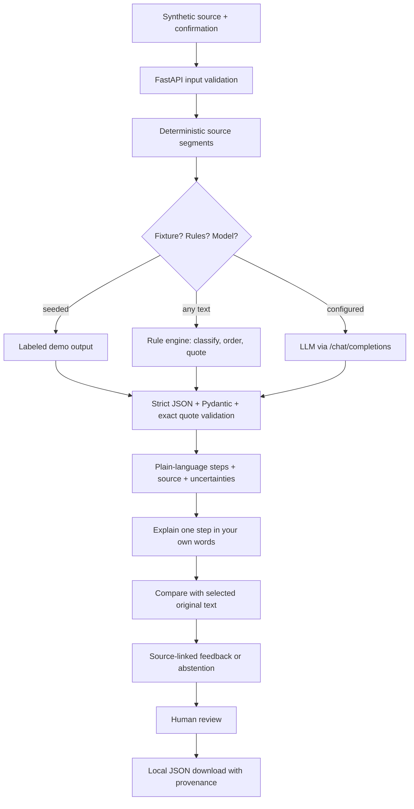

# Asclepius
### AI + Healthcare Entry for ForgeHacks 2026 — The Care Instructions Desk

[](https://forgehacks-2026.devpost.com/)
[](https://github.com/mareknardella-lgtm/asclepius-s-staff)
[](https://github.com/mareknardella-lgtm/asclepius-s-staff)
[](https://fastapi.tiangolo.com/)
[](https://react.dev/)
[](https://www.ahrq.gov/health-literacy/improve/precautions/tool5.html)
[](LICENSE)


> **"Clear care instructions you can explain in your own words."**

**Understand your care instructions. Clarify what you understood. Keep your care team in the loop.**

AI + Healthcare entry for ForgeHacks 2026. Asclepius turns written instructions into source-linked steps, invites an explanation in the user's own words (*teach-back*), and exports a reviewed plan with its original text and provenance.

> **Research prototype. Synthetic data only. Not medical advice or clinically validated.** No diagnosis, emergency triage, prescribing, medication-dose plan, appointment booking or automated care action. With no key configured, Asclepius runs a **deterministic rule engine, not AI**, and says so on screen and in the exported record.

## Problem

A readable summary does not reveal whether someone has misunderstood a condition or deadline in discharge instructions. Patients and caregivers need to see the original wording, identify uncertainty and discuss questions with their care team.

The interaction is informed by [AHRQ's teach-back guidance](https://www.ahrq.gov/health-literacy/improve/precautions/tool5.html): explain information in one's own words, clarify and check again without blaming the person. This supports the method, **not** the effectiveness or clinical validity of this app. Asclepius-specific user needs and outcomes have not been validated.

## Interface

Two screens, written for patients and caregivers rather than clinicians: short sentences, everyday words, one action at a time.

1. **Understand your instructions** — the original note stays on the left with numbered source lines. The right column opens with one plain question ("What should I do at home?"), then gives the first step with its exact wording, the rest of the steps, what still needs a person to explain it, and the teach-back question.
2. **Check it and save** — where every suggestion must be accepted, changed or set aside before the copy can be confirmed and downloaded.

Engine provenance is still declared, but in plain words on screen ("Written by simple rules that copy words from your own text. No AI model was used."). The exact `origin` code, prompt version, request id and timings stay in the "How this was made" disclosure at the bottom of the column and in the exported JSON.

Seeded case (fictional, labeled in the interface): Amira Patel, 62 years, Northfield Day Unit, document issued 04 Oct 2026 09:20 UTC, atorvastatin 20 mg recorded without a dosing schedule, haemoglobin 13.2 g/dL (record interval 12.0–16.0) and sodium 139 mmol/L (135–145). Values are copied from the fictional record and never interpreted by the tool.

Design decisions are measurable, not decorative:

| Token group | Choice |
| --- | --- |
| Colour | Five base values only: warm paper `#f5f2ea`, ink `#20312c`, primary `#245e52`, muted `#59665e`, alert `#a12e28`. Rules and washes derive from them. The alert colour is reserved for clinical urgency and is currently unused: no feature detects an emergency. |
| Type | Source Serif 4 for display, Public Sans for interface, IBM Plex Mono for values, identifiers and timings. Self-hosted under `frontend/public/fonts` with OFL licences; no system default, Inter or Roboto. |
| Scale & space | One 10-step spacing scale, one 9-step type scale, shared radii, hairline weights and motion tokens in `:root`. |
| Evidence | Every claim links to a numbered source line that highlights in the note; unsourced claims are labelled as limitations, not findings. |
| Human-in-the-loop | Each suggestion has Accept / Edit / Set aside with a required reason for edits and overrides. Confirmation and download unlock only after every suggestion has a decision. |
| States | Skeleton while the plan or comparison runs, empty source, neutral error with the text preserved, an explicit "I could not check this one" with no evidence, and a "Please check this" marker on unreviewed steps. |
| Accessibility | Measured in the browser: body text 12.2:1, secondary 5.4:1, primary 6.7:1, on-primary 6.7:1, secondary on wash 4.9:1, hairlines 3.5:1, focus ring 6.7:1 at 3px. Interactive targets are at least 44px (the 20px checkbox sits inside a 44px label). Status is always text, never colour alone; `prefers-reduced-motion` disables animation. |

## Demo and current status

- **Implemented:** end-to-end local workflow, exact-quote validation, strict JSON/schema parsing, teach-back endpoint, human review and provenance-preserving export.
- **Works on any synthetic note:** a deterministic rule engine ([rules.py](backend/app/ai/rules.py)) handles free text, not only the seeded examples. It classifies each line by clinical cue, orders steps by priority, quotes the source verbatim and abstains rather than guessing.
- **Verified:** 93 backend tests, 21 frontend tests, mypy, typecheck, production build, corpus measurement and a real browser journey on typed free text with an inspected export payload. See [verification status](docs/status.md).
- **Not yet verified:** a real model call, semantic benchmark results, usability study or clinical correctness. Credentials are not included.
- **Not published:** deployment, video and submission. Repository publication is a separate authorized step; do not invent missing URLs.

### Three engines, always labelled

The interface states which engine produced every result, and the same value is exported with the take-away record.

| `origin` | What it is | Needs |
| --- | --- | --- |
| `scripted_fixture` | The labeled seeded demo note | Nothing |
| `local_rules` | Deterministic rules over your own text | Nothing — works offline |
| `model` | A configured LLM over an OpenAI-compatible API | `AI_PROVIDER=openai` plus a key |

`matched` is never presented as understanding or safety. See [Devpost copy and video script](docs/devpost.md) and the [demo script](docs/demo-script.md).

### Measured, not asserted

`python scripts/evaluate_rules.py` over the bundled synthetic corpus prints:

```
Plan cases: 20
  contract valid     20/20
  grounded quotes    20/20
  no medication steps 20/20
Comparison cases: 30  exact-label match 25
```

**Zero of 30** cases produce a false `matched`. Every miss sends a correct explanation back for clarification, which is the safe direction to fail; the five residual misses are valid paraphrases a rule engine cannot resolve, and are listed by case id.

## Solution

A single English-language workflow:

1. Open a labeled practice discharge note (or paste other practice text) and confirm no real patient data.
2. Create a source-linked plan: the first step, the other steps, and what still needs a person.
3. Pick the step you want to say back, explain it in your own words and request a comparison with the original wording.
4. Review every suggestion, accept, edit or set it aside, then confirm and download the reviewed copy.

Editing the source invalidates the plan, feedback and review. Editing an explanation invalidates its feedback and review. No server-side sessions, database, localStorage or care actions are used. Downloaded files remain with the user.



[Architecture and API](docs/architecture.md) · [Product selection and acceptance criteria](docs/day-1.md) · [Decisions](docs/decisions.md)

## AI and reliability

- Meaningful model tasks: preserving conditions/negations in a simplified explanation and comparing free-form paraphrases with the selected original text. Word matching alone is insufficient.
- Deterministic code validates structure, source IDs and exact quote membership. **Valid citations do not prove semantic entailment, completeness, document authenticity or medical truth.**
- One explicit request for a plan and one per explanation; no agents, retries, browsing, external tool execution or silent mock fallback.
- `matched`, `needs_clarification`, `unable_to_assess` describe estimated text correspondence, not calibrated confidence, comprehension certification or clinical safety.
- Model prompts prohibit diagnosis, triage and operational medication instructions. These semantic restrictions still require real-model evaluation; schema validation alone cannot enforce them.
- Provider errors, timeout, rate limit, incomplete responses, malformed JSON and invented citations fail explicitly without accepting a partial plan.

## Stack

React 19, Vite 6, TypeScript; Python 3.12+, FastAPI, Pydantic, HTTPX. Tests: pytest, mypy, Vitest and Testing Library. Interface styles are hand-written CSS driven by design tokens; Tailwind was removed with the redesign. Self-hosted OFL fonts add no runtime dependency. No SDK, database or retrieval infrastructure.

## Local setup

Prerequisites: Python 3.12+ and Node 22.12+ with npm. Tested locally on Windows with Python 3.14 and Node 24. npm dependencies are resolved in [package-lock.json](frontend/package-lock.json); Python ranges are in [requirements.txt](backend/requirements.txt), without a transitive lock.

### Windows (Git Bash or PowerShell)

`python` on PATH may be an older interpreter (3.9 was found on this machine). Check `python --version` and use a 3.12+ interpreter explicitly; on Windows the launcher `py -3.14` selects one by minor version.

```sh
git clone https://github.com/mareknardella-lgtm/asclepius-s-staff.git
cd asclepius-s-staff

py -3.14 -m venv backend/.venv      # any 3.12+ interpreter; confirm with py -0
backend/.venv/Scripts/python.exe -m pip install --no-input -r backend/requirements.txt
npm --prefix frontend ci --no-audit --no-fund
python scripts/dev.py               # launcher script itself runs on older Python, the backend needs 3.12+
```

If `backend/.venv` was created with an older interpreter, recreate it: the launcher now refuses to start it and prints the required version instead of failing later with an unrelated error.

### macOS / Linux

```sh
git clone https://github.com/mareknardella-lgtm/asclepius-s-staff.git
cd asclepius-s-staff

python3 -m venv backend/.venv       # verify: python3 --version  ->  3.12 or newer
backend/.venv/bin/python -m pip install --no-input -r backend/requirements.txt
npm --prefix frontend ci --no-audit --no-fund
python3 scripts/dev.py
```

Open **http://127.0.0.1:5173**. API docs: **http://127.0.0.1:8000/docs**. The launcher verifies the venv interpreter is Python 3.12+, checks ports, does not stop other servers, and stops only its own subprocesses on Ctrl+C. To verify startup and cleanup without leaving servers running, use `python scripts/dev.py --api-port 8100 --web-port 5273 --smoke-test`. This was tested on Windows with Python 3.14 and Node 24; macOS/Linux use the same paths resolved by the script but have not been run here. Alternative ports:

```sh
python scripts/dev.py --api-port 8100 --web-port 5273
```

No `.env` or account is needed for the mock. To start servers separately:

```sh
# Backend directory; use .venv/bin/python on macOS/Linux
.venv/Scripts/python.exe -m uvicorn app.main:create_app --factory --host 127.0.0.1 --port 8000
# Workspace root, separate terminal
npm --prefix frontend run dev -- --port 5173
```

Vite proxies `/api` to FastAPI. It does not silently choose a different port. For separate processes use `API_PROXY_TARGET` for Vite and `FRONTEND_ORIGIN` for backend CORS. A static production build does not include the dev proxy; `vite preview` alone is not end-to-end hosting.

## Real provider configuration

Copy [.env.example](.env.example) to a local `.env` at the workspace root. It is ignored by Git. Keep secrets out of the frontend, screenshots, logs and `VITE_*` variables.

| Variable | Default | Meaning |
| --- | --- | --- |
| `AI_PROVIDER` | `mock` | `mock` runs the offline engine (fixtures + rules); `openai` calls a compatible API |
| `AI_API_KEY` | empty | Backend secret required for real calls |
| `AI_BASE_URL` | `https://api.openai.com/v1` | HTTPS; HTTP only on loopback |
| `AI_MODEL` | empty | Explicit compatible model identifier |
| `AI_TIMEOUT_SECONDS` | `30` | 1–120 seconds |
| `AI_MAX_OUTPUT_TOKENS` | `800` | 100–2000 output tokens; truncated output fails explicitly |
| `FRONTEND_ORIGIN` | `http://localhost:5173` | Single allowed CORS origin; launcher sets loopback origin |
| `API_PROXY_TARGET` | `http://127.0.0.1:8000` | Vite process environment, not backend `.env` |

The adapter uses `/chat/completions`, `temperature: 0`, `max_tokens` and `response_format: {"type":"json_object"}`. A compatible provider/model must support these options. JSON mode is not schema enforcement; Pydantic and grounding validation remain required. Restart the backend after configuration changes.

OpenAI was researched as a compatible candidate; no account, credentials or paid request were created. Compatibility, access, cost, retention and policy must be checked for the selected model/account. No zero-retention or privacy-compliance promise is made. `/health` reports configuration/liveness, **not** live model readiness. Only synthetic examples are allowed, even with a real provider.

## API

- `GET /health`: status, configured protocol/provider, model.
- `POST /analyze`: `{ "text": "...", "synthetic_data_confirmed": true }` → `care-v1` metadata and `CarePlan`.
- `POST /teach-back`: source, confirmation, selected `focus { id, evidence }`, `answer` → source-grounded comparison.
- Every response carries `origin`: `scripted_fixture`, `local_rules` or `model`. The client rejects a payload whose origin disagrees with its provider flag.
- Validation errors `422`; provider rate limit `429`; invalid/unavailable/ungrounded output `502`; timeout `504`.
- Download: `asclepius-<plan.request_id>.json`, UTF-8 `care-export-v1`, includes source, plan, current explanation/feedback, review and limitations.

The API is stateless; a valid selected quote is not proof of a previous plan/session. Detailed fields and limits are in [architecture](docs/architecture.md).

## Verification

```sh
# Backend directory; .venv/bin/python on macOS/Linux
.venv/Scripts/python.exe -m pytest -q
.venv/Scripts/python.exe -m mypy
# Workspace root
npm --prefix frontend run typecheck
npm --prefix frontend test
npm --prefix frontend run build
# Windows; backend/.venv/bin/python on macOS/Linux
backend/.venv/Scripts/python.exe scripts/evaluate_care.py --validate-only
backend/.venv/Scripts/python.exe scripts/evaluate_rules.py
```

[care_cases.json](backend/tests/care_cases.json) contains **20 authored synthetic plan rubrics and 30 pre-annotated explanations**, ten per assessment label. This is a test corpus, not external clinical data.

[evaluate_rules.py](scripts/evaluate_rules.py) scores the offline engine on that corpus with no network call, printing grounding, safety and a comparison confusion matrix. It measures the rules, not what a model would say; those are different claims.

Optional **real-provider evaluation** (50 provider requests, potentially billable, no automatic retries):

```sh
backend/.venv/Scripts/python.exe scripts/evaluate_care.py --run --output reports/live-evaluation.json
```

It refuses mock mode and existing output paths. Output reports errors, labels and timings; plan semantics remain explicitly `not_reviewed` until a human checks the predeclared rubrics. A single run is not the full baseline/three-run/usability protocol defined in [Day 1](docs/day-1.md). An exit 0 does not imply clinical safety. Local reports are ignored to prevent accidental publication of unreviewed outputs.

## Security and deployment limits

Synthetic-source confirmation is not anonymization or a reliable detector of personal data. Limits: 20–4000 Unicode code points after newline normalization/strip, at most 80 non-empty lines; explanation up to 1000 code points; strict schema/output limits. Source and answer are treated as untrusted input. UI renders text, not model HTML.

No intentional prompt/result logging or server-side persistence; provider-side retention is separate. Export contains the source and explanation: consider where the user saves it.

**Do not expose the paid API publicly as-is.** Before internet deployment add authentication/access control, application rate limits, budget/concurrency controls, proxy body limits, HTTPS/API routing and a reviewed data policy. This prototype is not an emergency service, medical device certification or a GDPR/HIPAA compliance claim.

## Impact and remaining work

No measured improvement in health, comprehension or usability. Mock milliseconds are not AI inference latency. Live semantic evaluation, comparison baseline, volunteer testing, screenshots/video artifacts, deployment and submission remain gates. See [status](docs/status.md) and [submission checklist](docs/submission-checklist.md).

## Project structure

```text
frontend/           React UI, design tokens, runtime API validation, tests
frontend/public/    Self-hosted OFL fonts (Source Serif 4, Public Sans, IBM Plex Mono)
backend/app/        FastAPI configuration and endpoints
backend/app/ai/     Prompts, schemas, grounding, fixtures, adapters
backend/tests/      Unit/API/transport tests and synthetic corpus
scripts/            Local launcher, intake gate, real-provider evaluator
docs/               Product selection, architecture, demo, status, audit
.env.example        Configuration template without credentials
```

## Event rules and attribution

Prompts checked against the [official site](https://www.forgehacks.dev/) and [Devpost rules](https://forgehacks-2026.devpost.com/rules) on October 4, 2026. The user-provided [blueprint](ForgeHacks_2026_Project_Blueprint.md) guides the workflow and is preserved unchanged; ForgeHacks is the event, **Asclepius** is the product.

The generic foundation predates the product selection; Healthcare-specific schemas, source validation, teach-back, UI and corpus were added after receiving the prompts. Disclose pre-existing work and AI coding assistance honestly. Team eligibility and membership are not verified here.

Deadline discrepancy: Devpost banner says October 10, 12:00 **EDT** (16:00 UTC); rules body says **EST** (17:00 UTC). Confirm with organizers and plan against the earlier time. No submission or eligibility claim is made.

## Team and license

Team members and roles must be filled with real participant information before submission; none invented. Project code uses [MIT](LICENSE), authorized by its owner. Publication of code is not public deployment or clinical release.
