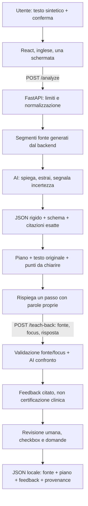

# Architettura — Asclepius

## Stato: attivo vs progettato

**Implementato:** Healthcare v1, UI inglese, piano con citazioni, teach-back, review/export e due fixture sintetiche dichiarate. **Verificato:** percorso locale mock; nessuna prova AI live o validazione clinica. La v0 è storico e non è più supportata. [Stato verifiche](status.md).

Stack invariato: React/Vite/TypeScript, CSS nativo con design tokens; FastAPI/Pydantic/HTTPX; adapter async sostituibile. Nessuna nuova dipendenza o servizio selezionato in questa milestone.

## Percorso prodotto implementato



Provider mock e reale restano distinti, senza fallback silenzioso. La generazione del piano e il confronto teach-back sono chiamate esplicite separate; nessun agente, browsing, tool execution o loop. Non serve retrieval: la fonte è l'input stesso. Un database non serve al percorso scelto: niente sessioni server, storico, login o azioni esterne nel MVP locale.

Tre motori, dichiarati in ogni risposta dal campo `origin`:

- `scripted_fixture`: documento dimostrativo etichettato, output scritto a mano.
- `local_rules`: [rules.py](../backend/app/ai/rules.py), motore deterministico che segmenta, classifica per indizio clinico, ordina per priorità, riscrive il gergo senza toccare condizioni/negazioni/scadenze e cita la riga originale. Non è un modello e non viene presentato come tale.
- `model`: provider OpenAI-compatible configurato.

Il client rifiuta una risposta il cui `origin` sia incoerente con il flag provider: l'etichetta non può essere raddrizzata dal frontend.

## Contratto API v0 — storico, ritirato

- `GET /health` → `{ "status": "ok", "provider": "mock" | "openai", "model": string | null }`. Liveness/configurazione, non raggiungibilità del modello.
- `POST /analyze` → `{ "text": string, "context": string }`. Testo 20–4000 caratteri dopo strip; contesto opzionale, massimo 2000. Campi extra rifiutati.
- Risposta → `{ "request_id": UUID, "provider": ..., "model": ..., "is_mock": boolean, "origin": ..., "elapsed_ms": integer, "result": AIResult }`.
- `AIResult`: `summary`, `reasoning`, `recommendation`, `confidence` (0–1 o null), `actions` (0–5 descrizioni con priorità low/medium/high).
- Confidence non calibrata; mock null. Export dopo review, nessuna raccomandazione eseguita.

## Contratto API v1 — implementato

Migrazione coordinata backend/frontend/test completata nel prototipo locale. Il percorso `/analyze` resta, body e risultato cambiano; client verificano `schema_version: care-v1`. Il campo generico `context` e la confidence numerica sono stati rimossi. Le vecchie richieste non sono compatibili; campi extra sono rifiutati.

### Convenzioni e limiti comuni

- JSON rigido: chiavi duplicate, NaN/Infinity, campi extra e stringhe fuori limite rifiutati. Nessun rendering HTML/Markdown dell'output.
- Normalizzare CRLF/CR a LF e strip del testo **prima** di verificare 20–4000 caratteri. Massimo 80 righe non vuote, verificate prima della chiamata provider. Segmentazione deterministica per righe non vuote; ID `s1`, `s2`, ... nell'ordine, stringhe originali delle righe mantenute. Non usare indici UTF-16/Unicode condivisi tra Python e JS per le citazioni.
- Conferma `synthetic_data_confirmed: true` obbligatoria in entrambe le richieste. È un vincolo d'uso, non rilevamento/anonimizzazione dei dati; non autorizza dati sanitari reali.
- Busta risposta: `schema_version: "care-v1"`, `prompt_version: string`, `request_id: UUID`, `provider: "mock" | "openai"`, `model: string | null`, `is_mock: boolean`, `origin: "scripted_fixture" | "local_rules" | "model"`, `elapsed_ms: integer >= 0`, `result: <schema specifico>`.
- `Evidence`: `{ "segment_id": string, "quote": string }`, quote non vuota, massimo 4000 caratteri. Backend verifica ID esistente e quote come sottostringa **esatta** del segmento normalizzato. Non accettare citazioni di testi nel campo answer.
- Identificatori degli elementi: stringhe non vuote fino a 40 caratteri e uniche nella lista. Ogni elemento riferito dal feedback deve esistere nella richiesta; nessun link/contatto creato dal modello.
- `422`: richiesta non valida; `429`: rate limit provider; `502`: provider, schema o grounding non valido; `504`: timeout. Errori operativi sanitizzati come v0: `{ "detail": { "code": string, "message": string } }`; input errors con `detail` standard FastAPI. Mancanza di informazioni nella fonte può produrre 200 con clarifications e zero passi, non errore operativo.

### `POST /analyze`

Richiesta:

```json
{
  "text": "SYNTHETIC EXAMPLE. Arrange a follow-up within seven days, even if you feel better. Bring your discharge instructions to that visit.",
  "synthetic_data_confirmed": true
}
```

`result: CarePlan`:

| Campo | Tipo / vincolo / origine |
| --- | --- |
| `source_segments` | Array `SourceSegment { id, text }`, generato dal backend, non dal modello. Copre le righe non vuote dell'input normalizzato. |
| `summary` | Stringa 1–1200 caratteri, spiegazione semplice, non nuova diagnosi. |
| `items` | 0–6 `CareItem { id, instruction, evidence }`; instruction 1–600 caratteri, evidence 1–3 riferimenti validati. Scadenze/condizioni rimangono nel testo, nessun calcolo di date o priorità clinica. |
| `clarifications` | 0–6 `{ description, evidence }`; description 1–600, evidence 0–3. Zero citazioni ammesso per un'informazione assente o un limite di scope, non per supportare un nuovo consiglio clinico. |
| `questions_for_care_team` | 0–3 stringhe 1–300 caratteri; domande, non raccomandazioni terapeutiche. |

Il modello propone summary/items/clarifications/questions; backend aggiunge i segmenti e valida i riferimenti. Testo non pertinente o solo farmacologico produce zero passi operativi e un limite spiegato, non un piano inventato. L'esclusione dei dosaggi è un vincolo di prompt, schema di dominio e benchmark semantico: non promettere che una regex dimostri sicurezza.

### `POST /teach-back`

Richiesta:

```json
{
  "text": "SYNTHETIC EXAMPLE. Arrange a follow-up within seven days, even if you feel better. Bring your discharge instructions to that visit.",
  "synthetic_data_confirmed": true,
  "focus": {
    "id": "step-1",
    "evidence": [{
      "segment_id": "s1",
      "quote": "Arrange a follow-up within seven days, even if you feel better."
    }]
  },
  "answer": "I only need to arrange the follow-up if I still feel unwell."
}
```

- `answer`: stringa 1–1000 caratteri dopo strip.
- `focus`: ID dell'elemento per correlazione UI, evidence 1–3. Backend ricalcola i segmenti da `text` e valida ID/quote. **Non** riceve una sintesi o raccomandazione client come fonte attendibile.
- Il modello confronta l'answer con il focus citato nel contesto della fonte. Un focus valido non certifica che derivi da un precedente piano: API stateless senza sessione firmata; UI limita la scelta ai passi del piano corrente. Fonte e answer rimangono non attendibili come istruzioni.

`result: TeachBackResult`:

| Campo | Tipo / significato |
| --- | --- |
| `focus_id` | ID uguale a quello della richiesta, verificato dal backend. |
| `status` | `matched`, `needs_clarification`, `unable_to_assess`. Il primo significa corrispondenza stimata al passaggio, non competenza del paziente o sicurezza medica. |
| `feedback` | Stringa 1–1000, non colpevolizzante, senza nuova consulenza; per incertezza chiede di chiarire. |
| `evidence` | 0–3 riferimenti esatti. Almeno uno per matched/needs_clarification; zero possibile soltanto per unable_to_assess, senza affermazioni mediche. |

Citazioni valide non provano che il confronto sia semanticamente corretto. T05 e benchmark devono misurare separatamente i falsi `matched`.

### Export locale — nessun endpoint server

Nome: **`asclepius-<plan.request_id>.json`**. JSON UTF-8, leggibile/indentato, `schema_version: "care-export-v1"`, con:

- `source_text`: fonte normalizzata, synthetic data flag;
- `plan`: busta CarePlan completa (provider/model/is_mock/prompt version inclusi);
- `teach_back`: null o `{ answer, response: <busta TeachBackResult> }` corrente;
- `review`: `{ confirmed: true, reviewed_at: <ISO 8601 UTC>, item_states: [{ id, state: "read" | "ask_care_team" }] }`;
- `limitations`: stringhe su scope educativo/sintetico, assenza di validazione clinica e significato di mock/live.

Nessun esito “cura completata”, “appuntamento prenotato” o “persona comprende” dedotto dal click. Download richiesto non prova file salvato: la verifica browser deve ispezionare l'artefatto. Stato e review invalidati se cambia input; risposta modificata invalida feedback. Il file scaricato resta sotto il controllo dell'utente e contiene anche la fonte: avvertire prima dell'export.

## Modello dati e confini

| Entità | Owner / durata |
| --- | --- |
| `SourceSegment` | Backend derivato dall'input, restituito al client; nessuna tabella. |
| `Evidence`, `CareItem`, `CarePlan` | Risultato strutturato AI validato e arricchito; browser in memoria. |
| `TeachBackResult` | Risultato di una chiamata esplicita; browser in memoria. |
| Revisione e stato passi | UI locale, azioni dell'utente, mai affermazioni generate di cure eseguite. |
| Export | File creato solo su conferma, nessun upload/salvataggio server. |

## Sicurezza e reliability

- Segreti backend, URL/provider configurati dall'operatore, HTTPS (HTTP solo loopback), niente chiavi `VITE_*`.
- Limiti input/output/token/timeout della foundation riusati; verificare che il nuovo schema non tronchi l'output prima di modificare il budget. Nessun retry/fallback automatico.
- Errori sanitizzati; nessun logging intenzionale di fonti, parafrasi o risposte AI. Non implica zero conservazione dal provider: policy da verificare prima della prova live.
- Nessun dato sanitario reale, diagnosi, triage o piano farmacologico nel MVP; solo esempi sintetici dichiarati. Non destinato a emergenze, non sostituisce il personale sanitario.
- Grounding significa provenienza testuale, non verità clinica. Teach-back non è un test di memoria né una certificazione della comprensione.
- UI tratta testo/output come testo, non codice. Download e checkbox non eseguono istruzioni sanitarie.
- API locale non pronta per internet: prima di deploy servono auth, rate limit, budget/concorrenza, body limits, HTTPS/routing e policy dati. Nessuna conformità GDPR/HIPAA o classificazione regolatoria dichiarata.

## Test e gate

Test strutturali/API/UI coprono input/consenso, normalizzazione/Unicode, citazioni inventate, focus falsificato, output ostile/invalido, invalidazione ed export. [Corpus](../backend/tests/care_cases.json): 20 documenti con rubriche e 30 teach-back etichettati. [Evaluator](../scripts/evaluate_care.py) valida offline e richiede provider reale per misurare label/timing; non attribuisce correttezza semantica ai piani automaticamente. [evaluate_rules.py](../scripts/evaluate_rules.py) misura il motore offline sullo stesso corpus senza rete: 20/20 ancorati, 20/20 senza farmaco nei passi, 25/30 etichette, **0 falsi `matched`**. Gli scarti sono paraphrasi valide che un motore a regole non risolve e vengono elencati per id.

Percorso browser mock verificato con artefatto JSON ispezionato, desktop/mobile e console/rete. La parte semantica T02/T04/T05 e il benchmark live restano aperti: test strutturali non sono prove di sicurezza clinica.

Rischi aperti: credenziali/policy/provider reale assenti; correttezza clinica non validata; elegibilità/pre-existing-work/timezone da confermare; repository/deployment/video non ancora pubblicati al momento della verifica. [Stato verifiche](status.md).
